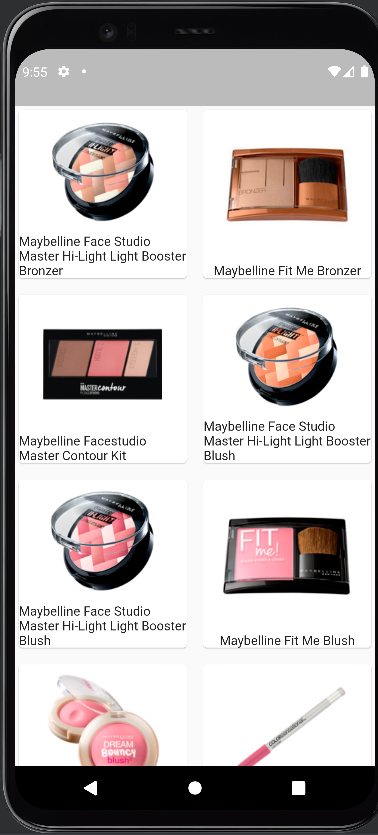

# july_one

A new Flutter project.

## Getting Started

This project is a starting point for a Flutter application.

A few resources to get you started if this is your first Flutter project:

- [Lab: Write your first Flutter app](https://docs.flutter.dev/get-started/codelab)
- [Cookbook: Useful Flutter samples](https://docs.flutter.dev/cookbook)

For help getting started with Flutter development, view the
[online documentation](https://docs.flutter.dev/), which offers tutorials,
samples, guidance on mobile development, and a full API reference.

## About the project
Within the scope of the project, the data were taken from [https://makeup-api.herokuapp.com/] and reflected on the screen with Flutter.

The following plugins from [https://pub.dev/] have been added to the pubspec.yaml file.
- mobx: ^2.0.7+4
- flutter_mobx: ^2.0.6+1
- mobx_codegen: ^2.0.7
- build_runner: ^2.1.11

mobile images

